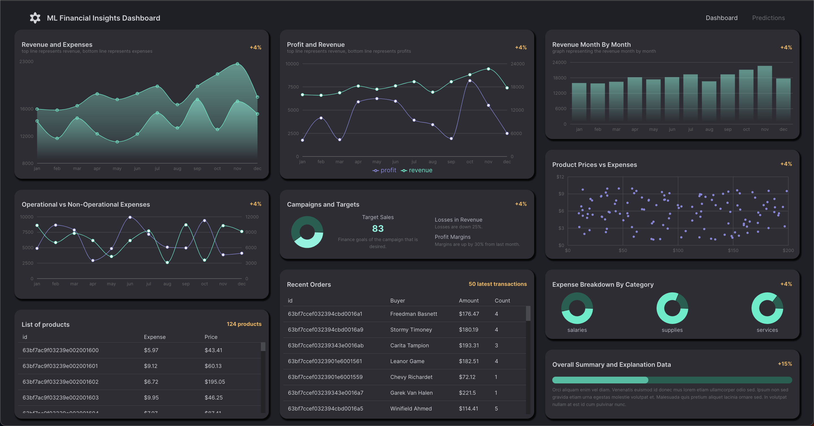
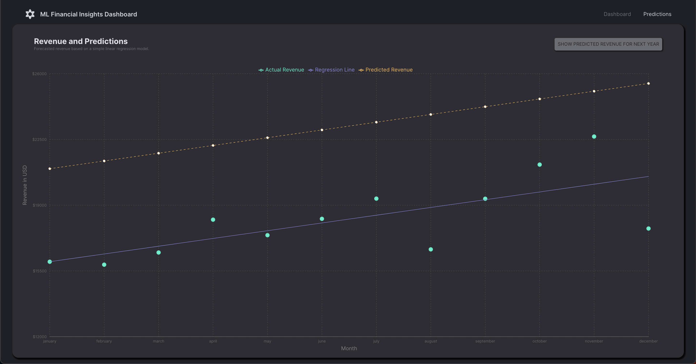

# Finance Dashboard with Machine Learning Predictions

## Project Overview

This project is a comprehensive finance dashboard that leverages machine learning to predict a company's financials for the next year. It's built using the MERN stack (MongoDB, Express.js, React, Node.js) and incorporates TypeScript, Material-UI (MUI), and Redux Toolkit for a robust and scalable application.

## Screenshots

### Dashboard Overview

### Machine Learning Predictions

## Features

- **Machine Learning Predictions:** Utilizes advanced algorithms to forecast financial performance.
- **Dynamic Dashboards:** Interactive and customizable panels displaying key financial metrics.
- **Data Modeling and Management:** Efficient handling of financial data with MongoDB.
- **Responsive Design:** Optimized for various devices and screen sizes.

## Technologies Used

- **Frontend:** React, TypeScript, MUI
- **Backend:** Node.js, Express.js
- **Database:** MongoDB
- **State Management:** Redux Toolkit
- **Machine Learning:** Python, ML Libraries

